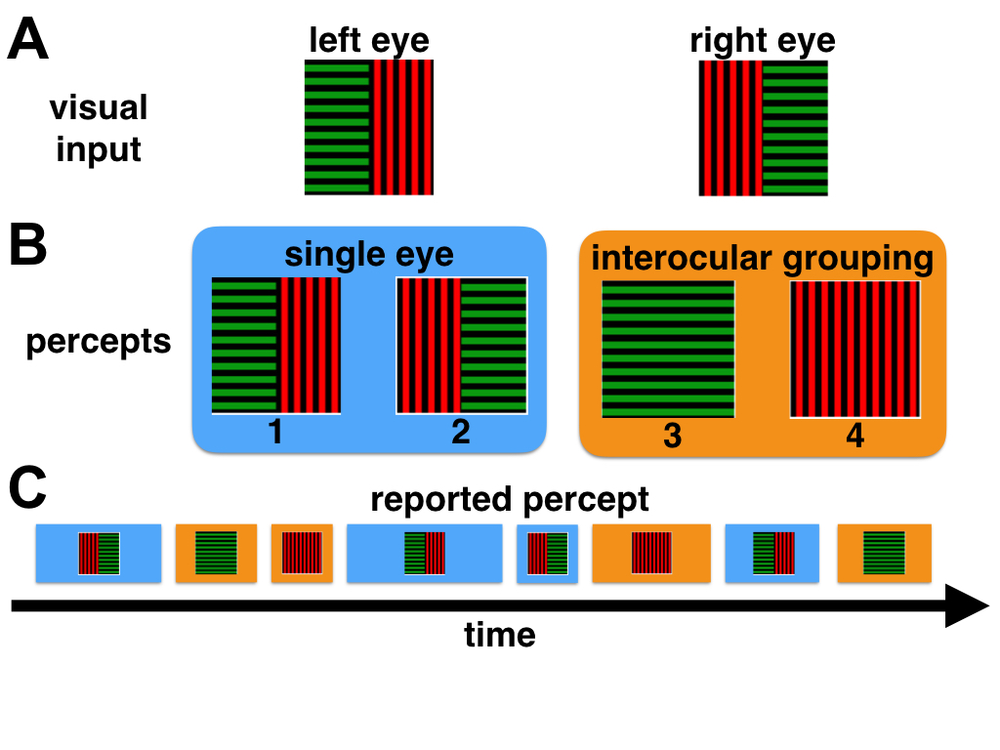

## Description of experiments.
Subjects viewed the stimulus depicted inthe figure below, each consisting of half a horizontal grating and half of a vertical grating.



In addition, grating halves were chosen randomly to be either red (HSV color space coordinates: 0.497, 0.4/0.9, 0.7) or green (120.23, 0.4/0.9, 0.7), but commensurate halves always had the same color. The stimulus was displayed on a grey background (0.0, 0.0, 0.2) and two unfilled squares and two horizontal and vertical lines were added on top of it in order to help the subject align the two images. Two different levels of saturation were used for each color, 0.4 and 0.9.

One session was divided into six 3-minute  trials. Trials were separated by a 90-second resting period. To allow subjects time to adapt to the stimulus and form a stable percept,
the first 30 seconds of each trial were not recorded. The association between color and orientation was kept the same within each session, but was randomized across sessions. For example, the vertical grating was red within a session, whereas the horizontal grating was always green. In contrast, saturation was randomized across trials, as was the position of the split gratings (left or right eye), to avoid any dominant eye effects. The randomization was such that within one session, each saturation level appeared in three trials and each grating positioning occurred in three trials.

Each subject of nine subjects  was planned to participate in six total sessions three per orientation/color pairing: four subjects  finished 6 total sessions(AJ, MA, ZK, ND), three subjects finished
5 sessions (FG, YW, ML), one subject finished 4 sessions (AB) and the remaing one finished 7 session (ZM). More specifically,

* ZM:  a total of 42 trials and 21 trials at each saturations for each subject.
* AJ, MA, ZK, ND:  a total of 36 trials and 18 trials at each saturations for each subject.
* FG, YW, ML:  a total of 30 trials and 15 trials at each saturations for each subject.
* AB:  a total of 24 trials and 12 trials at each saturations.


The observers were asked to indicate dominance duration of four different percepts in the figure above by holding down four different buttons on a gamepad.
Subjects were instructed to press button 1 if they perceive a single-eye percept (a percept composed of a vertical and horizontal part) with a red left half, button 2 for a stimulus with a red left half, button 3 for an  fused, entirely green percept, and button 4 for an  fused, entirely red percept. When the subjects perceived anything different from the four percepts, they were instructed not to press any button.


## Description of the data

The data is given in a single frame with several columns. The subject ID and
trial number are listed first. Each trial has an associated color saturation value
(0.4 or 0.9). Eact trial is also characterized by which color is associated with the 
vertical direction.  For instance G_V means that the vertical bars are green. The last two columns
list the percepts (Tdata.perc): 0 represents transition between two percepts, 1 represents percept 1, 2 represents percept 2 and so on.  and the duration of the percept (Tdata.duration) in microseconds, in the order
reported by each subject.  

```{r}
data <- read.csv('dataInOneTable.csv')
head(data)
```

From this we computed the  ratio of the total time, $T_{\rm grouped}$, that observers 
reported a grouped percept out of the time they reported seeing a coherent 
percept (Percepts 1, 2, 3 and 4) during each trial. We thus recorded for each trial, $i,$ of each subject,
$$ratio(i) = \frac{T_{\rm grouped}(i)}{T_{\rm grouped}(i) + T_{\rm single}(i)}$$
.  


```{r computing_ratios_grouped_percept_dominance, include=FALSE}
#ADDED BY YUNJIAO: BEGINNING
# loading data in csv file.
dataInTable <- read.csv('dataInOneTable.csv')

nTrials <- unique(dataInTable$nTrial)
# set up a data frame to store dominance ratios (grouped/ (grouped + single))
fused_over_fusedNSingle_ratios <- data.frame(IDs = c(), Sat =c(), ratios=c())
Data_trials <- split(dataInTable, dataInTable$nTrial)

for (i in nTrials){
  data <- Data_trials[[i]]
  fused <- subset(data, data$Tdata.perc ==3 | data$Tdata.perc ==4)
  single <- subset(data, data$Tdata.perc ==1 | data$Tdata.perc ==2)
  totalFused <- sum(fused$Tdata.duration)
  totalSingle <- sum(single$Tdata.duration)
  ratio <-  totalFused /(totalFused + totalSingle)
  ID <- data$IDs[1]
  Sat <- data$Sat[1]
  newData <- data.frame(IDs = ID, Sat = Sat, Ratio = ratio)
  fused_over_fusedNSingle_ratios <- rbind(fused_over_fusedNSingle_ratios,newData)
}

write.csv(fused_over_fusedNSingle_ratios, 'fused_over_fusedNSingle_ratios.csv',row.names=FALSE)
#ADDED BY YUNJIAO: END

```


```{r demonstrate_data_Ratios}
data.ratios <- read.csv('fused_over_fusedNSingle_ratios.csv') 
names(data.ratios)<- c("ID","Sat","ratio")
head(data.ratios)
```

In the following analysis we account for the subject and saturation factors, and pool data over all trials of the same subject.
Thus the percept reported by pressing button 1 was always had a red left, and green right half, but the orientation (vertical or horizontal) of each half depended on the trial.

## Predominance of grouped and single-eye percepts

Predominance of a percept here means the fraction of time that the percept is perceived.
We first check if there is a difference in the predominance of grouped percepts.
Our hypothesis was that the predominance increases with saturation as the cue relating the two halves of the stimulus
became stronger.

We first present the raw ratios in each condition

```{r ID_Order, echo=FALSE}

data.ratios <- read.csv('fused_over_fusedNSingle_ratios.csv')

# To make the results easy to read, we rearrange ID ordering according to the average ratio 
# difference at the two different saturation for each ID

# BEGIN of the reordering
ratios_split_by_ID <- split(data.ratios, list(data.ratios$Sat,data.ratios$IDs) )
Means_by_ID <- lapply(ratios_split_by_ID, function(x) mean(x$Ratio))
Mean04 <- Means_by_ID[2*c(1:9)-1]
Mean09 <- Means_by_ID[2*c(1:9)]
DifferenceMean <- data.frame(ID = c(), difference = c())
for (i in c(1:9)){
  difference <- Mean09[[i]] - Mean04[[i]]
  ID <- ratios_split_by_ID[[2*i-1]]$ID[1]
  newData <- data.frame(ID = ID, difference = difference)
  DifferenceMean <- rbind(DifferenceMean, newData)
}
reOrderRatioDifference <- DifferenceMean[order(DifferenceMean$difference, decreasing=TRUE) , ]
ID_order <- reOrderRatioDifference$ID
# We will use this ID order
ID_order <- as.vector(ID_order)
# END of the reordering

```

```{r boxplot_ratios, echo=FALSE,warning=FALSE, message=FALSE}

names(data.ratios)<- c("ID","Sat","ratio")

data.ratios$ID <- factor(data.ratios$ID, levels=ID_order)
data.ratios$Sat <- factor(data.ratios$Sat)

library(ggplot2)

p = ggplot(data = data.ratios, aes(x = ID, y = ratio)) + 
              geom_boxplot(aes(fill = Sat), width = 0.8) + theme_bw() +
              ggtitle("Predominance of grouped percepts report for different Saturation")
print(p)

```

The predominance of grouped states tends to increase for most
observers. We next compute the probability to show that this increase is real.
To do so, we partitioned trials based on the 
color saturation level used for each trial, grouping across all other conditions. We analyzed
changes in predominance using a linear Student-t regression model to account for skewness
in the data. We included the condition (low/high color saturation) as a covariate and set
the degrees of freedom of the t distribution to 4 to provide robust inference while avoiding
computational difficulties often encountered when using a prior for the degrees of freedom
(Fonseca et al., 2008). Prior distributions for the regression coeffcients were independent
and normal with mean 0, and variance 104. We estimated the mean difference in the fraction
of time and its 95% credible interval (CI) and the probability that the difference is greater
than 0.

```{r bayesian_Anaysis_Ratio_linear_fit, include=FALSE,cache=TRUE}
# This is the analysis of the ratio spent in the fused and single
# eye state

source("ModelDefinitionT.R")
# We analyze the data by first doing individual fits
# A linear model and Bayesian model per subject 

#Just the estimate of the difference and the credibility interval
results.Bayes<-matrix(NA,nrow=9,ncol=3)
colnames(results.Bayes)<-c("mean","loCI","upCI")
diffmeans <- c(1:9)
prob = c(1:9)

i = 1

#output <- data.frame("ID"=levels(data.ratios$ID), "mean" = c(1:9), "low CI" = c(1:9), 
 #                    "high CI" = c(1:9), "probability" = c(1:9)  )
output <- data.frame("ID"=ID_order, "mean" = c(1:9), "low CI" = c(1:9), 
                    "high CI" = c(1:9), "probability" = c(1:9)  )

for( subject in ID_order) {
  
  #Data for subject j, separated into two vectors for different contrast
  data1 <- data.ratios[data.ratios$ID == subject, ]

  y1.low <- data1[data1$Sat == 0.4,]
  y1.high <- data1[data1$Sat == 0.9,]
  
  y1 = c( y1.low$ratio , y1.high$ratio ) # combine data into one vector
  
  # vector of conditions, where 0 is for low (0.4) and 1 for high (0.9) contrast
  x1 = c( rep(0,length(y1.low$ratio)) , rep(1,length(y1.high$ratio)) ) 
 
  combined = data.frame(x1,y1)

  #run a Bayesian model.  Details can be found ModelDefinitionT
  mcmcCoda = genMCMC( data=combined , xName="x1" , yName="y1" ,numSavedSteps=500000  )
  
  results.Bayes[i,]<-c(summary(mcmcCoda)$stat[2,1],summary(mcmcCoda)$quant[2,c(1,5)])
  
  # get the results of MCMC run, and compute probability that
  # the slope (beta1) is positive. This is the probability that the
  # fraction of time spent in the fused state increases between conditions.
  mcmcMat = as.matrix(mcmcCoda,chains=TRUE)
  prob[i] = sum(mcmcMat[,3]>0)/length(mcmcMat[,3])
  
  diffmeans[i] = mean(y1.low$ratio) - mean(y1.high$ratio)
  
  #Write the results in the output matrix
  output[i,] = c(subject, summary(mcmcCoda)$stat[2,1]
                 ,summary(mcmcCoda)$quant[2,c(1,5)], prob[i])
  i = i+1
  
}
```


The results are presented in the table below.  The table suggests that this is a real effect for five subjects (ZK, AJ, ML, AB, MA). In these
subjects, the fraction of time they perceive a grouped states goes up about 10%  or higher  with an increase in saturation. 

```{r result_bayesian_linear_fit_in_table, results="asis",echo=FALSE}
library(htmlTable)

tryOutput<- output
tryOutput$ID <- as.character(tryOutput$ID)
for (i in c(2:5)){
  tryOutput[,i] <- as.numeric(tryOutput[,i])
}
is.num <- sapply(tryOutput, is.numeric)
tryOutput[is.num] <- lapply(tryOutput[is.num], round,digits=3)
for (i in c(1:9)){
  if (tryOutput[i,5]>0.999){
    tryOutput[i,5] <-0.999
  }
}

for (i in c(2:4)){
  tryOutput[,i]<- round(tryOutput[,i], digits=3)
}


htmlTable(txtRound(tryOutput,3), align="ccccc",
		 header=paste(c("ID", "<sup>a</sup>diff.", "low CI", "high CI ", "prob."),"&nbsp;"),
		   padding.tspanner="&nbsp;&nbsp;&nbsp;",
		  css.cgroup = "",
		  #rowlabel="",
		  rnames=FALSE,
		  caption="Ratios of grouped percepts",
		  tfoot="<sup>a</sup>diff. = mean at saturation 0.9 - mean at saturation 0.4 ",
		  ctable=TRUE)

```

The following figure shows the distributions of means at each saturation level for each subject seperately. 


```{r Bayesian_Analysis_Predominance_Separate_Saturation_Distr, cache=TRUE, include=FALSE}
data.ratios <- read.csv('fused_over_fusedNSingle_ratios.csv')
names(data.ratios) <- c("ID","Sat","ratio")

library(rjags)
source("ModelDefLevel.R")

outputData <- data.frame(ID=c(), Sat=c(), meanPar = c()  )

for( subject in ID_order) {
  
  #Data for subject j, separated into two vectors for different saturations
  data1 <- data.ratios[data.ratios$ID == subject, ]
  y1.low <- data1[data1$Sat == 0.4,]
  y1.high <- data1[data1$Sat == 0.9,]
  for (j in c(1:2)){
    if (j==1){
    y1=y1.high$ratio
    }else{
     y1=y1.low$ratio
    }
    combined = data.frame(y1)
  
  #run a Bayesian model.  Details can be found ModelDefinitionT
   mcmcCoda = genMCMC( data=combined, yName="y1" ,numSavedSteps=500000  )
   mcmcMat = as.matrix(mcmcCoda,chains=TRUE)
   meanBeta = mcmcMat[,2]
  
  
    if (j==1){
      newData<- data.frame(ID=rep(subject, length(mcmcMat[,2]) ), Sat=rep(0.9,    length(mcmcMat[,2])), meanPar = mcmcMat[,2])
      
      outputData <- rbind(outputData,newData)
      
    } else{
     newData<- data.frame(ID=rep(subject, length(mcmcMat[,2]) ), Sat=rep(0.4,    length(mcmcMat[,2])), meanPar = mcmcMat[,2])
      
      outputData <- rbind(outputData,newData)
     
    }
  } # end of j loop 
}
```


```{r Bayesian_Analysis_Ratio_Separate_Saturation, cache=TRUE, include=FALSE}
data.ratios <- read.csv('fused_over_fusedNSingle_ratios.csv')
names(data.ratios) <- c("ID","Sat","ratio")

library(rjags)
source("ModelDefLevel.R")

# here the probability needs some work
prob = c(1:9)

i = 1

outputHigh <- data.frame("ID"=ID_order, "mean" = c(1:9), "low CI" = c(1:9), 
                     "high CI" = c(1:9), "probability" = c(1:9)  )
outputLow <- data.frame("ID"=ID_order, "mean" = c(1:9), "low CI" = c(1:9), 
                     "high CI" = c(1:9), "probability" = c(1:9)  )

for( subject in ID_order) {
  
  #Data for subject j, separated into two vectors for different saturations
  data1 <- data.ratios[data.ratios$ID == subject, ]
  y1.low <- data1[data1$Sat == 0.4,]
  y1.high <- data1[data1$Sat == 0.9,]
  for (j in c(1:2)){
    if (j==1){
    y1=y1.high$ratio
    }else{
     y1=y1.low$ratio
    }
  

    combined = data.frame(y1)
  
  #run a Bayesian model.  Details can be found ModelDefinitionT
    mcmcCoda = genMCMC( data=combined, yName="y1" ,numSavedSteps=500000  )
   mcmcMat = as.matrix(mcmcCoda,chains=TRUE)
   prob[i] = sum(mcmcMat[,2]<0.5)/length(mcmcMat[,2])
  
  
    if (j==1){
     outputHigh[i,] = c(subject, summary(mcmcCoda)$stat[1,1],summary(mcmcCoda)$quant[1,c(1,5)], prob[i])
    } else{
     outputLow[i,] = c(subject, summary(mcmcCoda)$stat[1,1],summary(mcmcCoda)$quant[1,c(1,5)], prob[i])
     #MeanSdPlotLow[i,] <- c(subject,summary(mcmcCoda)$stat[1,c(1,2)])
    }
  } # end of j loop 
  i = i+1
  
}
```

The difference for five out of nine subjects
 are large while the effect for others are nearly negligible. 

```{r result_bayesian_ratio_separate_sat_fig2,results='asis',echo=FALSE}
library(ggplot2)

outputHigh1 <- outputHigh
outputLow1 <- outputLow
outputHigh1  <-cbind(outputHigh1,Sat = c(rep(0.9,length(outputHigh1$mean))))
outputLow1  <-cbind(outputLow1,Sat = c(rep(0.4,length(outputLow1$mean))))
for (i in c(2:5)){
  outputHigh1[,i] <- as.numeric(outputHigh1[,i])
  outputLow1[,i] <- as.numeric(outputLow1[,i])
}
outputAll <- rbind(outputHigh1,outputLow1)

outputAll$Sat <- as.factor(outputAll$Sat)
outputAll$ID <- factor(outputAll$ID, levels=ID_order)
ggplot(outputAll, aes(x=ID,y=mean,fill=Sat))+geom_bar(stat="identity",position=position_dodge(width=0.85))+geom_errorbar(aes(ymin=low.CI, ymax=high.CI), width=.1, position=position_dodge(width=0.85))+
  theme(text = element_text(size=20), axis.text = element_text(size=16))+
        #panel.grid.major = element_line(colour = "grey95"),
        #panel.background=element_rect(fill="white"))+
  xlab("Subject")+
  ylab("Predominance")

```

The detailed mean values are listed in the table below.

```{r ratios_Bayesian_separate_result_in_table, results="asis", echo=FALSE}
library(htmlTable)
resultHigh <- outputHigh
resultHigh <- as.data.frame(resultHigh)
resultHigh$ID <- as.character(resultHigh$ID)
for (i in c(2:5)){
  resultHigh[,i] <- as.numeric(as.character(resultHigh[,i]))
}
is.num <- sapply(resultHigh, is.numeric)
resultHigh[is.num] <- lapply(resultHigh[is.num], round,3)
for (i in c(1:9)){
  if( resultHigh[i,5]>0.999){
    resultHigh[i,5] <- 0.999
  }
}
for (i in c(2:4)){
  resultHigh[,i]<- round(resultHigh[,i], digits=3)
}

resultLow <- outputLow
resultLow <- as.data.frame(resultLow)
resultLow$ID <- as.character(resultLow$ID) 
for (i in c(2:5)){
  resultLow[,i] <- as.numeric(as.character(resultLow[,i]))
}
is.num <- sapply(resultLow, is.numeric)
resultLow[is.num] <- lapply(resultLow[is.num], round,3)
for (i in c(1:9)){
  if( resultLow[i,5]>0.999){
    resultLow[i,5] <- 0.999
  }
}
for (i in c(2:4)){
  resultLow[,i]<- round(resultLow[,i], digits=3)
}
resultsAll <- cbind(resultLow[1:5],resultHigh[1:5])
cgroup = c("Sat=0.4","Sat=0.9")
n.cgroup = c(5, 5)
#is.num <- sapply(resultsAll, is.numeric)
#resultsAll[is.num] <- lapply(resultsAll[is.num], round,2)
htmlTable(txtRound(resultsAll, digits=3), align="ccccc|cccc",
		  header=paste(c("ID", "mean", "low CI", "high CI ","<sup>a</sup>prob.", "ID", "mean", "low CI", "high CI","prob."),"&nbsp;&nbsp; "),
		  cgroup = cgroup,
		   padding.tspanner="&nbsp;&nbsp;&nbsp;&nbsp;&nbsp;",
		  css.cgroup = "",
		  n.cgroup = n.cgroup, 
		  rnames=FALSE,
		  caption="Effect of saturation level on dominance duration",
		  tfoot="<sup>a</sup>prob. = probability(mean < 0.5)",
		  ctable=TRUE)

```

## Saturation level effects on dominance duration and number of visits
We next examine whether this increase in the predominance of grouped percepts is due to an increase in the mean time of grouped percepts reports, a decrease in 
the  mean time single eye percept reports, or an increased
probability of switching to a grouped percept (number of visits to grouped percepts).

### Increase in color saturation decreases dominance duration of single-eye percepts 

We next compared the mean dominance duration for both single-eye and grouped percepts under the two conditions

```{r Dominance_duration_Bayesian_linear_fit, include=FALSE,cache=TRUE}

data <- read.csv('dataInOneTable.csv')

# Factor for converting from microseconds to seconds
rescale.f = 1000000

# This code chunk will peform a Bayesian analysis of the data.
# Included - but not in the output - is a straigthforward linear model just to check
# that the results are in line with a frequentist analysis.

# Source for Bayesian model
source("ModelDefinitionT.R")

results.singlelm<-matrix(NA,nrow=9,ncol=3)
colnames(results.singlelm)<-c("mean","standard error","p-value")
results.fusedlm<-matrix(NA,nrow=9,ncol=3)
colnames(results.fusedlm)<-c("mean","standard error","p-value")
diffmeans.single <- c(1:9)
diffmeans.fused <- c(1:9)
#results.singleBayes<-matrix(NA,nrow=9,ncol=5)
results.singleBayes<-matrix(0,nrow=9,ncol=5)
colnames(results.singleBayes)<-c("ID","mean","low CI","high CI","Probability")
#results.fusedBayes<-matrix(NA,nrow=9,ncol=5)
results.fusedBayes<-matrix(0,nrow=9,ncol=5)
colnames(results.fusedBayes)<-c("ID","mean","low CI","high CI","Probability")
mean.low = c(1:9)
mean.high = c(1:9)

i = 1

for( j in ID_order) {
  
  data1 <- data[data$IDs == j & data$Tdata.perc > 0,]
  
  # Define the single eye durations for low (0.4) and high (0.9) saturation.
  y1s.low <- data1[data1$Sat == 0.4 & (data1$Tdata.perc == 1 |  data1$Tdata.perc == 2),]$Tdata.duration/rescale.f
  y1s.high <- data1[data1$Sat == 0.9 & (data1$Tdata.perc == 1 |  data1$Tdata.perc == 2),]$Tdata.duration/rescale.f
  
  y1s = c( y1s.low , y1s.high ) # combine data into one vector
  
   # create group membership code, 0 for low, 1 for high
  x1s = c( rep(0,length(y1s.low)) , rep(1,length(y1s.high)) )
  
  #same for fused state reports
  y1f.low <- data1[data1$Sat == 0.4 & (data1$Tdata.perc == 3 |  data1$Tdata.perc == 4),]$Tdata.duration/rescale.f
  y1f.high <- data1[data1$Sat == 0.9 & (data1$Tdata.perc == 3 |  data1$Tdata.perc == 4),]$Tdata.duration/rescale.f
  
  y1f = c( y1f.low , y1f.high ) # combine data into one vector
  x1f = c( rep(0,length(y1f.low)) , rep(1,length(y1f.high)) ) # create group membership code
  
  # fit linear model and save results - this runs fast, so doing it along with Bayesian fit
  fit.s = lm(y1s~x1s)
  fit.f = lm(y1f~x1f)
  results.singlelm[i,] = c(summary(fit.s)$coefficients[2,1],summary(fit.s)$coefficients[2,2],summary(fit.s)$coefficients[2,4])
  results.fusedlm[i,] = c(summary(fit.f)$coefficients[2,1],summary(fit.f)$coefficients[2,2],summary(fit.s)$coefficients[2,4])
  
  # fit Bayesian model - comment out to run only linear model
  combined.single = data.frame(x1s,y1s)
  combined.fused = data.frame(x1f,y1f)
  mcmcCoda.single = genMCMC( data=combined.single , xName="x1s" , yName="y1s" ,numSavedSteps=20000  )
  mcmcCoda.fused = genMCMC( data=combined.fused , xName="x1f" , yName="y1f" ,numSavedSteps=20000 )
  
  #Compute the probability that there has been a change
  mcmcMat.single = as.matrix(mcmcCoda.single,chains=TRUE)
  prob.single = sum(mcmcMat.single[,3]<0)/length(mcmcMat.single[,3])
  mcmcMat.fused = as.matrix(mcmcCoda.fused,chains=TRUE)
  prob.fused = sum(mcmcMat.fused[,3]<0)/length(mcmcMat.fused[,3])
  
  results.singleBayes[i,]<-c(j,summary(mcmcCoda.single)$stat[2,1],summary(mcmcCoda.single)$quant[2,c(1,5)],prob.single)
  results.fusedBayes[i,]<-c(j,summary(mcmcCoda.fused)$stat[2,1],summary(mcmcCoda.fused)$quant[2,c(1,5)],prob.fused)
  
  
#   mean.low[i] =  mean(y1s.low)
#   mean.high[i] = mean(y1s.high)
  diffmeans.single[i] = mean(y1s.low) - mean(y1s.high)
  diffmeans.fused[i] = mean(y1f.low) - mean(y1f.high)
  
  i = i+1
  
}

```


The following table shows the posterior probability for the difference in the mean duration of the single eye percept reports and grouped percept reports in the low and high saturation conditions separately. A negative value indicates a decrease.
The same subjects  that show an increased ratios of observing grouped percepts demonstrate a decreased fraction of reports of single-eye percepts. Comparing with the single-eye dominance duration, grouped percept dominance duration do not tend to change with saturation level. Only two subjects, AB and ZM, showed a probable decrease in duration with an increase change in color saturation.  

```{r single_Dom_duration_Bayesian_linear_fit_result_in_table, results="asis", echo=FALSE}
library(htmlTable)
trySingle <- results.singleBayes
trySingle <- as.data.frame(trySingle)
trySingle$ID <- as.character(trySingle$ID)
for (i in c(2:5)){
  trySingle[,i] <- as.numeric(as.character(trySingle[,i]))
}
is.num <- sapply(trySingle, is.numeric)
trySingle[is.num] <- lapply(trySingle[is.num], round,3)
for (i in c(1:9)){
  if( trySingle[i,5]>0.999){
    trySingle[i,5] <- 0.999
  }
}
for (i in c(2:4)){
  trySingle[,i]<- round(trySingle[,i], digits=3)
}

tryfused <- results.fusedBayes
tryfused <- as.data.frame(tryfused)
tryfused$ID <- as.character(tryfused$ID) 
for (i in c(2:5)){
  tryfused[,i] <- as.numeric(as.character(tryfused[,i]))
}
is.num <- sapply(tryfused, is.numeric)
tryfused[is.num] <- lapply(tryfused[is.num], round,3)
for (i in c(1:9)){
  if( tryfused[i,5]>0.999){
    tryfused[i,5] <- 0.999
  }
}
for (i in c(2:4)){
  tryfused[,i]<- round(tryfused[,i], digits=3)
}
resultsAll <- cbind(trySingle[1:5],tryfused[1:5])
cgroup = c("single-eye perc","grouped perc. ")
n.cgroup = c(5, 5)
#is.num <- sapply(resultsAll, is.numeric)
#resultsAll[is.num] <- lapply(resultsAll[is.num], round,2)
htmlTable(txtRound(resultsAll, digits=3), align="ccccc|cccc",
		  header=paste(c("ID", "<sup>a</sup>diff.", "low CI", "high CI ","prob.", "ID", "<sup>a</sup>diff.", "low CI", "high CI","prob."),"&nbsp;&nbsp; "),
		  cgroup = cgroup,
		   padding.tspanner="&nbsp;&nbsp;&nbsp;&nbsp;&nbsp;",
		  css.cgroup = "",
		  n.cgroup = n.cgroup, 
		  rnames=FALSE,
		  caption="Effect of saturation level on dominance duration",
		  tfoot="<sup>a</sup>diff. = mean at saturation 0.9 - mean at saturation 0.4 ",
		  ctable=TRUE)

```


The following figure shows the dominance duration of single-eye percepts and grouped percepts at each saturation level for each subject separately.


```{r Dom_duration_Bayesian_separate_sat2, cache=TRUE, include=FALSE}
data <- read.csv('dataInOneTable.csv')
#ID_order<-unique(data$IDs)
# Factor for converting from microseconds to seconds
rescale.f = 1000000

# This code chunk will peform a Bayesian analysis of the data.
# Included - but not in the output - is a straigthforward linear model just to check
# that the results are in line with a frequentist analysis.

# Source for Bayesian model
#source("ModelDefinitionT.R")
source("ModelDefLevel.R")

single_output<-data.frame(ID=c(),Sat=c(), meanPar=c())
grouped_output<-data.frame(ID=c(),Sat=c(), meanPar=c())

results.singleBayesHigh<-matrix(0,nrow=9,ncol=5)
colnames(results.singleBayesHigh)<-c("ID","mean","low CI","high CI","Probability")
results.singleBayesLow<-matrix(0,nrow=9,ncol=5)
colnames(results.singleBayesLow)<-c("ID","mean","low CI","high CI","Probability")
#results.fusedBayes<-matrix(NA,nrow=9,ncol=5)
results.fusedBayesHigh<-matrix(0,nrow=9,ncol=5)
colnames(results.fusedBayesHigh)<-c("ID","mean","low CI","high CI","Probability")
results.fusedBayesLow<-matrix(0,nrow=9,ncol=5)
colnames(results.fusedBayesLow)<-c("ID","mean","low CI","high CI","Probability")

i = 1

for( subject in ID_order) {
  
  data1 <- data[data$IDs == subject & data$Tdata.perc > 0,]
  
  # Define the single eye durations for low (0.4) and high (0.9) saturation.
  y1s.low <- data1[data1$Sat == 0.4 & (data1$Tdata.perc == 1 |  data1$Tdata.perc == 2),]$Tdata.duration/rescale.f
  y1s.high <- data1[data1$Sat == 0.9 & (data1$Tdata.perc == 1 |  data1$Tdata.perc == 2),]$Tdata.duration/rescale.f
  
   y1f.low <- data1[data1$Sat == 0.4 & (data1$Tdata.perc == 3 |  data1$Tdata.perc == 4),]$Tdata.duration/rescale.f
  y1f.high <- data1[data1$Sat == 0.9 & (data1$Tdata.perc == 3 |  data1$Tdata.perc == 4),]$Tdata.duration/rescale.f
  for (j in c(1:2)){
    if (j==1){
    y1s<-y1s.high
    y1f<- y1f.high
    }else{
     y1s<- y1s.low
     y1f<-y1f.low
    }
  
  
  # fit Bayesian model - comment out to run only linear model
  combined.single = data.frame(y1s)
  combined.fused = data.frame(y1f)
  mcmcCoda.single = genMCMC( data=combined.single ,  yName="y1s" ,numSavedSteps=20000  )
  mcmcCoda.fused = genMCMC( data=combined.fused ,  yName="y1f" ,numSavedSteps=20000 )
  
  #Compute the probability that there has been a change
  mcmcMat.single = as.matrix(mcmcCoda.single,chains=TRUE)
  prob.single = sum(mcmcMat.single[,3]<0)/length(mcmcMat.single[,3])
  mcmcMat.fused = as.matrix(mcmcCoda.fused,chains=TRUE)
  prob.fused = sum(mcmcMat.fused[,3]<0)/length(mcmcMat.fused[,3])
  
  if (j==1){
  results.singleBayesHigh[i,]<-c(subject,summary(mcmcCoda.single)$stat[1,1],summary(mcmcCoda.single)$quant[1,c(1,5)],prob.single)
  results.fusedBayesHigh[i,]<-c(subject,summary(mcmcCoda.fused)$stat[1,1],summary(mcmcCoda.fused)$quant[1,c(1,5)],prob.fused)
  
  Lsingle <- length(mcmcMat.single[,2])
  newSingle <- data.frame(ID=rep(subject,Lsingle), Sat=rep(0.9, Lsingle),meanPar=mcmcMat.single[,2])
  single_output <- rbind(single_output,newSingle)
  
  Lgrouped <- length(mcmcMat.fused[,2])
  newGrouped <- data.frame(ID=rep(subject,Lgrouped), Sat=rep(0.9, Lgrouped),meanPar=mcmcMat.fused[,2])
  grouped_output <- rbind(grouped_output,newGrouped)
  
  }else{
     results.singleBayesLow[i,]<-c(subject,summary(mcmcCoda.single)$stat[1,1],summary(mcmcCoda.single)$quant[1,c(1,5)],prob.single)
  results.fusedBayesLow[i,]<-c(subject,summary(mcmcCoda.fused)$stat[1,1],summary(mcmcCoda.fused)$quant[1,c(1,5)],prob.fused)
  
  Lsingle <- length(mcmcMat.single[,2])
  newSingle <- data.frame(ID=rep(subject,Lsingle), Sat=rep(0.4, Lsingle),meanPar=mcmcMat.single[,2])
  single_output <- rbind(single_output,newSingle)
  
  Lgrouped <- length(mcmcMat.fused[,2])
  newGrouped <- data.frame(ID=rep(subject,Lgrouped), Sat=rep(0.4, Lgrouped),meanPar=mcmcMat.fused[,2])
  grouped_output <- rbind(grouped_output,newGrouped)
  }
  } # the end of j loop
  
  
  i = i+1
  
} # the end of subjct loop

```


The following figure shows the single-eye dominance durations at  different color saturations.

```{r single_dom_dur_Bayesian_Separate_Sat_result_in_fig2, echo=FALSE}
library(ggplot2)

outputHigh <- as.data.frame( results.singleBayesHigh)
colnames(outputHigh)<-c("ID","mean","low.CI","high.CI","Probability")
outputLow <-as.data.frame( results.singleBayesLow)
colnames(outputLow)<-c("ID","mean","low.CI","high.CI","Probability")
outputHigh  <-cbind(outputHigh,Sat = c(rep(0.9,length(outputHigh$mean))))
outputLow  <-cbind(outputLow,Sat = c(rep(0.4,length(outputLow$mean))))
for (i in c(2:5)){
  outputHigh[,i] <- as.numeric(as.character(outputHigh[,i]))
  outputLow[,i] <- as.numeric(as.character( outputLow[,i]))
}
outputAll <- rbind(outputHigh,outputLow)
#outputAll <-as.data.frame(outputAll)
outputAll$Sat <- as.factor(outputAll$Sat)
outputAll$ID <- factor(outputAll$ID, levels=ID_order)

ggplot(outputAll, aes(x=ID, y=mean,fill=Sat)) + geom_bar(stat="identity",position=position_dodge(width=0.85))+
  geom_errorbar(aes(ymin=low.CI, ymax=high.CI), width=.1, position=position_dodge(width=0.85)) +
 theme(text = element_text(size=20), axis.text = element_text(size=16))+
        #panel.grid.major = element_line(colour = "grey95"),
        #panel.background=element_rect(fill="white"))+
  xlab("Subject")+
  ylab("Dominance duration")+
 ggtitle("Single-eye perc.")

```


The following figure shows dominance durations of  grouped percepts at  different color saturations.

```{r grouped_perc_dom_dur_Bayesian_Separate_Sat_result_in_fig, echo=FALSE}
library(ggplot2)

outputHigh <- as.data.frame( results.fusedBayesHigh)
colnames(outputHigh)<-c("ID","mean","low.CI","high.CI","Probability")
outputLow <-as.data.frame( results.fusedBayesLow)
colnames(outputLow)<-c("ID","mean","low.CI","high.CI","Probability")
outputHigh  <-cbind(outputHigh,Sat = c(rep(0.9,length(outputHigh$mean))))
outputLow  <-cbind(outputLow,Sat = c(rep(0.4,length(outputLow$mean))))
for (i in c(2:5)){
  outputHigh[,i] <- as.numeric(as.character(outputHigh[,i]))
  outputLow[,i] <- as.numeric(as.character( outputLow[,i]))
}
outputAll <- rbind(outputHigh,outputLow)

outputAll$Sat <- as.factor(outputAll$Sat)

outputAll$ID <- factor(outputAll$ID, levels=ID_order)

#ggplot(outputAll, aes(x=ID, y=mean,ymax=max(mean)*1.05)) + 
 # geom_errorbar(aes(ymin=low.CI, ymax=high.CI, colour=Sat), width=.2, position=position_dodge(width=0.1)) +
  #geom_line(aes(group=Sat, colour=Sat)) +
#  geom_point(size=3, aes(group=Sat, colour=Sat), position=position_dodge(width=0.1))+
ggplot(outputAll, aes(x=ID, y=mean,fill=Sat)) + geom_bar(stat="identity",position=position_dodge(width=0.85))+
  geom_errorbar(aes(ymin=low.CI, ymax=high.CI), width=.1, position=position_dodge(width=0.85)) +
  theme(text = element_text(size=20), axis.text = element_text(size=16))+
        #panel.grid.major = element_line(colour = "grey95"),
        #panel.background=element_rect(fill="white"))+
  xlab("Subject")+
  ylab("Dominance duration")+
 ggtitle("Grouped perc.")

```

### Increasing saturation level increases ratios of the number of visits to grouped percepts.
We next use the same data as above compute ratios of the number of visits to grouped percepts.

 $$\frac{N_{\rm grouped}}{N_{\rm grouped} + N_{\rm single_eye}}$$

```{r computing_ratios_num_visits_grouped_percept, cache=TRUE,include=FALSE}
# loading data in csv file.
dataInTable <- read.csv('dataInOneTable.csv')

nTrials <- unique(dataInTable$nTrial)
# set up a data frame to store dominance ratios (grouped/ (grouped + single))
fused_over_fusedNSingle_ratios_Num_Visits <- data.frame(IDs = c(), Sat =c(), ratios=c())
Data_trials <- split(dataInTable, dataInTable$nTrial)

for (i in nTrials){
  data <- Data_trials[[i]]
  fused <- subset(data, data$Tdata.perc ==3 | data$Tdata.perc ==4)
  single <- subset(data, data$Tdata.perc ==1 | data$Tdata.perc ==2)
  totalFusedVisits <- length(fused$Tdata.perc)
  totalSingleVisits <- length(single$Tdata.perc)
  ratio <-  totalFusedVisits /(totalFusedVisits + totalSingleVisits)
  ID <- data$IDs[1]
  Sat <- data$Sat[1]
  newData <- data.frame(IDs = ID, Sat = Sat, Ratio = ratio)
  fused_over_fusedNSingle_ratios_Num_Visits <- rbind(fused_over_fusedNSingle_ratios_Num_Visits,newData)
}

write.csv(fused_over_fusedNSingle_ratios_Num_Visits, 'ratios_numberVisits_to_grouped.csv',row.names=FALSE)
```

Based on these ratios, we compute the mean for each 
subject at the each saturation condition. We use the same analysis as in the case of the predominance of
grouped percepts to compute the posterior probability of a change in this ratio.

```{r bayesian_NumberVisit_Ratio_linear_fit, include=FALSE,cache=TRUE}
# This is the analysis of the ratio spent in the fused and single
# eye state
data.ratios <- read.csv('ratios_numberVisits_to_grouped.csv')
names(data.ratios) <- c("ID","Sat","ratio")

library(rjags)
source("ModelDefinitionT.R")

# We analyze the data by first doing individual fits
# A linear model and Bayesian model per subject 

#Just the estimate of the difference and the credibility interval
results.Bayes<-matrix(NA,nrow=9,ncol=3)
colnames(results.Bayes)<-c("mean","loCI","upCI")
diffmeans <- c(1:9)
prob = c(1:9)

i = 1

#output <- data.frame("ID"=levels(data.ratios$ID), "mean" = c(1:9), "low CI" = c(1:9), 
 #                    "high CI" = c(1:9), "probability" = c(1:9)  )
output <- data.frame("ID"=ID_order, "mean" = c(1:9), "low CI" = c(1:9), 
                    "high CI" = c(1:9), "probability" = c(1:9)  )

for( subject in ID_order) {
  
  #Data for subject j, separated into two vectors for different contrast
  data1 <- data.ratios[data.ratios$ID == subject, ]
  #y1.low <- data1[data1$contrast == 0.4,]
  #y1.high <- data1[data1$contrast == 0.9,]
  y1.low <- data1[data1$Sat == 0.4,]
  y1.high <- data1[data1$Sat == 0.9,]
  
  y1 = c( y1.low$ratio , y1.high$ratio ) # combine data into one vector
  
  # vector of conditions, where 0 is for low (0.4) and 1 for high (0.9) contrast
  x1 = c( rep(0,length(y1.low$ratio)) , rep(1,length(y1.high$ratio)) ) 
 
  combined = data.frame(x1,y1)

  #run a Bayesian model.  Details can be found ModelDefinitionT
  mcmcCoda = genMCMC( data=combined , xName="x1" , yName="y1" ,numSavedSteps=500000  )
  
  results.Bayes[i,]<-c(summary(mcmcCoda)$stat[2,1],summary(mcmcCoda)$quant[2,c(1,5)])
  
  # get the results of MCMC run, and compute probability that
  # the slope (beta1) is positive. This is the probability that the
  # fraction of time spent in the fused state increases between conditions.
  mcmcMat = as.matrix(mcmcCoda,chains=TRUE)
  prob[i] = sum(mcmcMat[,3]>0)/length(mcmcMat[,3])
  
  diffmeans[i] = mean(y1.low$ratio) - mean(y1.high$ratio)
  
  #Write the results in the output matrix
  output[i,] = c(subject, summary(mcmcCoda)$stat[2,1]
                 ,summary(mcmcCoda)$quant[2,c(1,5)], prob[i])
  i = i+1
  
}
```


```{r result_bayesian_number_visits_linear_fit_in_table, results="asis",echo=FALSE}
library(htmlTable)

tryOutput<- output
tryOutput$ID <- as.character(tryOutput$ID)
for (i in c(2:5)){
  tryOutput[,i] <- as.numeric(tryOutput[,i])
}
is.num <- sapply(tryOutput, is.numeric)
tryOutput[is.num] <- lapply(tryOutput[is.num], round,3)
for (i in c(1:9)){
  if (tryOutput[i,5]>0.999){
    tryOutput[i,5] <-0.999
  }
}

for (i in c(2:4)){
  tryOutput[,i]<- round(tryOutput[,i], digits=3)
}


htmlTable(txtRound(tryOutput,3), align="ccccc",
		 header=paste(c("ID", "<sup>a</sup>diff.", "low CI", "high CI ", "prob."),"&nbsp;"),
		   padding.tspanner="&nbsp;&nbsp;&nbsp;",
		  css.cgroup = "",
		  #rowlabel="",
		  rnames=FALSE,
		  caption="Ratios of number of visits to grouped percepts",
		  tfoot="<sup>a</sup>diff. = mean at saturation 0.9 - mean at saturation 0.4 ",
		  ctable=TRUE)

```


```{r Bayesian_Analysis_numberVisits_Ratio_Separate_Saturation, include=FALSE,cache=TRUE}
data.ratios <- read.csv('ratios_numberVisits_to_grouped.csv')
names(data.ratios) <- c("ID","Sat","ratio")

library(rjags)
source("ModelDefLevel.R")

# here the probability needs some work
prob = c(1:9)

i = 1

outputData<-data.frame(ID=c(),Sat=c(), meanPar=c())

outputHigh <- data.frame("ID"=ID_order, "mean" = c(1:9), "low CI" = c(1:9), 
                     "high CI" = c(1:9), "probability" = c(1:9)  )
outputLow <- data.frame("ID"=ID_order, "mean" = c(1:9), "low CI" = c(1:9), 
                     "high CI" = c(1:9), "probability" = c(1:9)  )

for( subject in ID_order) {
  
  #Data for subject j, separated into two vectors for different saturations
  data1 <- data.ratios[data.ratios$ID == subject, ]
  y1.low <- data1[data1$Sat == 0.4,]
  y1.high <- data1[data1$Sat == 0.9,]
  for (j in c(1:2)){
    if (j==1){
    y1=y1.high$ratio
    }else{
     y1=y1.low$ratio
    }
  

    combined = data.frame(y1)
  
  #run a Bayesian model.  Details can be found ModelDefinitionT
    mcmcCoda = genMCMC( data=combined, yName="y1" ,numSavedSteps=500000  )
    
     mcmcMat = as.matrix(mcmcCoda,chains=TRUE)
 
  
    if (j==1){
     outputHigh[i,] = c(subject, summary(mcmcCoda)$stat[1,1],summary(mcmcCoda)$quant[1,c(1,5)], prob[i])
      Len <- length(mcmcMat[,2])
      newData <- data.frame(ID=rep(subject,Len), Sat=rep(0.9, Len),meanPar=mcmcMat[,2])
      outputData <- rbind(outputData,newData)
  
    } else{
     outputLow[i,] = c(subject, summary(mcmcCoda)$stat[1,1],summary(mcmcCoda)$quant[1,c(1,5)], prob[i])
     Len <- length(mcmcMat[,2])
      newData <- data.frame(ID=rep(subject,Len), Sat=rep(0.4, Len),meanPar=mcmcMat[,2])
      outputData <- rbind(outputData,newData)
    }
  } # end of j loop 
  i = i+1
  
}
```


The results are shown in the following figure. The analysis
is consistent with the result of predominance: the subjects ZK, AJ, ML  and AB, and to a lesser degree MA, show a consistent increases in the number of visits to grouped percepts. 

In summary, in some subjects an increase in color saturation level leads to an increase in the predominance of grouped percepts. This increase is due to two factors: the decrease in the domininace duration of single-eye percepts and the increase in the fraction of visits to grouped 
percepts. 


```{r result_bayesian_num_visits_ratio_separate_sat_in_fig,results='asis',echo=FALSE}
library(ggplot2)

outputHigh1 <- outputHigh
outputLow1 <- outputLow
outputHigh1  <-cbind(outputHigh1,Sat = c(rep(0.9,length(outputHigh1$mean))))
outputLow1  <-cbind(outputLow1,Sat = c(rep(0.4,length(outputLow1$mean))))
for (i in c(2:5)){
  outputHigh1[,i] <- as.numeric(outputHigh1[,i])
  outputLow1[,i] <- as.numeric(outputLow1[,i])
}
outputAll <- rbind(outputHigh1,outputLow1)

outputAll$Sat <- as.factor(outputAll$Sat)
outputAll$ID <- factor(outputAll$ID, levels=ID_order)
#ggplot(outputAll, aes(x=ID, y=mean,ymax=max(mean)*1.05)) + 
 # geom_errorbar(aes(ymin=low.CI, ymax=high.CI, colour=Sat), width=.2, position=position_dodge(width=0.1)) +
  #geom_line(aes(group=Sat, colour=Sat)) +
 # geom_point(size=3, aes(group=Sat, colour=Sat), position=position_dodge(width=0.1))+
ggplot(outputAll, aes(x=ID, y=mean,fill=Sat)) + geom_bar(stat="identity",position=position_dodge(width=0.85))+
  geom_errorbar(aes(ymin=low.CI, ymax=high.CI), width=.1, position=position_dodge(width=0.85)) +
  theme(text = element_text(size=20), axis.text = element_text(size=16))+
        #panel.grid.major = element_line(colour = "grey95"),
        #panel.background=element_rect(fill="white"))+
  xlab("Subject")+
  ylab("Ratios of number of visits")+
  ggtitle("Grouped perc.")

```

## Changes in transition probabilities

We next examine whether there is a change in the probability of transitions
between and among the grouped and single eye stimuli with an increase in color saturation. 
To estimate the transition probabilities between percept types,
we classified percepts into two states: single-eye, S, corresponding to percepts 1 and 2, and
grouped, G, corresponding to percepts 3 and 4. For each trial, we converted the data into two
binary data sequences: One sequence contained all transitions from state S with transitions
from S to S denoted by 1, and from S to G by 0. The second sequence contained transitions
from G, those from G to G denoted by 1, and from G to S by 0. We used all data obtained
by each subject in a given condition (low/high color saturation) to estimate the transition
probability from S to S, and from G to G by using a Binomial model with a Beta(1,1) prior
for the transition probability.
  

```{r transition_diff, include=FALSE, cache=TRUE}
# Load the functions used below:
source("DBDA2E-utilities.R") # Must be in R's current working directory.
require(rjags)  
source("ModelTransitionDiff.R")
# Load the data:
data <- read.csv('dataInOneTable.csv')
# Matrices that contain results for each subject

output.single <- data.frame("ID"=ID_order, "diff" = c(1:9), "low CI" = c(1:9), 
                    "high CI" = c(1:9), "prob." = c(1:9)  )

output.grouped<-data.frame("ID"=ID_order, "diff" = c(1:9), "low CI" = c(1:9), 
                    "high CI" = c(1:9), "prob." = c(1:9)  )

counter = 1
for (subject in ID_order){
  data.subj <- data[data$IDs==subject,] 
  data.subj = data.frame(data.subj$nTrial,data.subj$Tdata.perc,data.subj$Sat)
  names(data.subj) = c("Trial","Percept","Sat")
  # Keep only recorded percepts 
  data.subj = data.subj[data.subj$Percept>0,]
  # Seperate data by saturation.
  dataHigh <- data.subj[data.subj$Sat==0.9,]
  dataLow <-data.subj[data.subj$Sat==0.4,]
  # transtion binary single-to-single
  NAs <- rep(NA,10000)
  
  for (q in c(1:2)){
    if (q==1){
      # Deal with the data with high saturation level.
      Data_trials <- split(dataHigh, dataHigh$Trial)
    }else{
      # Deal with the data with low saturation level.
      Data_trials <- split(dataLow, dataLow$Trial)
    }
    
    #Data_trials <- split(dataHigh, dataHigh$Trial)
    nTrials <- length(Data_trials)
    singleN <- 0
    groupedN <- 0
    #ssAll <- data.frame(transition=NAs)
    #ggAll <- data.frame(transition=NAs)
    ssAll <- NAs
    ggAll <- NAs
    # run through all trials and for each trial we need to find the transition
    for (i in c(1:nTrials) ){
      dataOneTrial <- Data_trials[[i]]
      len <- length(dataOneTrial$Percept)
      for (j in c(1:(len-1))){
        #print(j)
        curP <- dataOneTrial$Percept[j]
        nextP <- dataOneTrial$Percept[j+1]
        #print(curP)
        #print(nextP)
        if (curP==1 | curP==2){
          singleN <- singleN +1
          if (nextP==1 | nextP==2){
           # ssAll$transition[singleN]<- 1
            ssAll[singleN]<- 1
          }else{
            #ssAll$transition[singleN]<- 0
            ssAll[singleN]<- 0
          }
        }else{
          groupedN <- groupedN +1
          if (nextP==3 | nextP==4){
            #ggAll$transition[groupedN]<- 1
            ggAll[groupedN]<- 1
          }else{
            #ggAll$transition[groupedN]<- 0
            ggAll[groupedN]<- 0
          }
        }
      }# end of go through one trial
    } # end of the loop of all trials
    
    # Analyze the data of ssAll and ggAll
    ssAll <- ssAll[c(1:singleN)]
    ggAll <- ggAll[c(1:groupedN)]
    
    if (q==1){
      ssAll.high<-ssAll
      ggAll.high<-ggAll
    }else{
      ssAll.low<-ssAll
      ggAll.low<-ggAll
    }
  } # end of q loop -- gone through two satuation loop.
    ysingle<-c(ssAll.low, ssAll.high)
    xsingle<-c(rep(0, length(ssAll.low)), rep(1, length(ssAll.high)))
    combined.single<- data.frame(xsingle, ysingle)
    
     ygrouped<-c(ggAll.low, ggAll.high)
     xgrouped<-c(rep(0, length(ggAll.low)), rep(1, length(ggAll.high)))
     combined.grouped<- data.frame(xgrouped, ygrouped)
    
    # compute for single-to single
    mcmcCoda_single = genMCMC( data=combined.single , xName="xsingle", yName="ysingle" ,numSavedSteps=500000)
    
    mcmcCoda_grouped = genMCMC( data = combined.grouped , xName="xgrouped", yName="ygrouped" ,numSavedSteps=500000)
    
      # compute probability for single to single
  mcmcMat = as.matrix(mcmcCoda_single,chains=TRUE)
  prob = sum(mcmcMat[,3]>0)/length(mcmcMat[,3])
  
  # final output for single to single
  output.single[counter,] = c(subject, summary(mcmcCoda_single)$stat[2,1]
                 ,summary(mcmcCoda_single)$quant[2,c(1,5)],  prob )
  
    # compute prob. for grouped to grouped.
   mcmcMat = as.matrix(mcmcCoda_grouped,chains=TRUE)
  prob = sum(mcmcMat[,3]>0)/length(mcmcMat[,3])
  
  # final output for grouped to grouped
  output.grouped[counter,] = c(subject, summary(mcmcCoda_grouped)$stat[2,1]
                 ,summary(mcmcCoda_grouped)$quant[2,c(1,5)],  prob )
  
  counter = counter + 1
  
  
}# end of subject loop
```

The results of the change of transition on color saturation are listed in the table below.

```{r results_diff_transition_in_table,  results="asis",echo=FALSE}
#library(xtable)
library(htmlTable)
trySingle <- output.single
trySingle$ID <- as.character(trySingle$ID)
for (i in c(2:5)){
  trySingle[,i] <- as.numeric(as.character(trySingle[,i]))
}
is.num <- sapply(trySingle, is.numeric)
trySingle[is.num] <- lapply(trySingle[is.num], round,3)
for (i in c(1:9)){
  if( trySingle[i,5]>0.999){
    trySingle[i,5] <- 0.999
  }
}
for (i in c(2:4)){
  trySingle[,i]<- round(trySingle[,i], digits=3)
}

tryfused <- output.grouped
tryfused$ID <- as.character(tryfused$ID) 
for (i in c(2:5)){
  tryfused[,i] <- as.numeric(as.character(tryfused[,i]))
}
is.num <- sapply(tryfused, is.numeric)
tryfused[is.num] <- lapply(tryfused[is.num], round,3)
for (i in c(1:9)){
  if( tryfused[i,5]>0.999){
    tryfused[i,5] <- 0.999
  }
}
for (i in c(2:4)){
  tryfused[,i]<- round(tryfused[,i], digits=3)
}
resultsAll <- cbind(trySingle[1:5],tryfused[1:5])
cgroup = c("single-to-single","grouped-to-grouped")
n.cgroup = c(5, 5)
#is.num <- sapply(resultsAll, is.numeric)
#resultsAll[is.num] <- lapply(resultsAll[is.num], round,2)
htmlTable(txtRound(resultsAll, digits=3), align="ccccc|cccc",
		  header=paste(c("ID", "<sup>a</sup>diff.", "low CI", "high CI ","prob.", "ID", "<sup>a</sup>diff.", "low CI", "high CI","prob."),"&nbsp;&nbsp; "),
		  cgroup = cgroup,
		   padding.tspanner="&nbsp;&nbsp;&nbsp;&nbsp;&nbsp;",
		  css.cgroup = "",
		  n.cgroup = n.cgroup, 
		  rnames=FALSE,
		  caption="Effect of saturation level on transition",
		  tfoot="<sup>a</sup>diff. = mean at saturation 0.9 - mean at saturation 0.4 ",
		  ctable=TRUE)


#xtable(resultsAll,digits=c(2,2,2,2,2,3, 0, 2, 2, 2,3))

```


  
Analyze saperately.

```{r Bayesian_transition, include=FALSE, cache=TRUE}
# Load the functions used below:
source("DBDA2E-utilities.R") # Must be in R's current working directory.

require(rjags)  
source("ModelDefinitionTransition.R")
# Load the data:
data <- read.csv('dataInOneTable.csv')
# Matrices that contain results for each subject

output_single <- data.frame(ID=c(), Sat=c(), meanPar=c())
output_grouped <- data.frame(ID=c(), Sat=c(), meanPar=c())

results.singleBayesHigh<-matrix(0,nrow=9,ncol=4)
colnames(results.singleBayesHigh)<-c("ID","mean","low CI","high CI")
results.singleBayesLow<-matrix(0,nrow=9,ncol=4)
colnames(results.singleBayesLow)<-c("ID","mean","low CI","high CI")
#results.fusedBayes<-matrix(NA,nrow=9,ncol=5)
results.fusedBayesHigh<-matrix(0,nrow=9,ncol=4)
colnames(results.fusedBayesHigh)<-c("ID","mean","low CI","high CI")
results.fusedBayesLow<-matrix(0,nrow=9,ncol=4)
colnames(results.fusedBayesLow)<-c("ID","mean","low CI","high CI")

counter = 1
for (subject in levels(data$IDs)){
  data.subj <- data[data$IDs==subject,] 
  data.subj = data.frame(data.subj$nTrial,data.subj$Tdata.perc,data.subj$Sat)
  names(data.subj) = c("Trial","Percept","Sat")
  # Keep only recorded percepts 
  data.subj = data.subj[data.subj$Percept>0,]
  # Seperate data by saturation.
  dataHigh <- data.subj[data.subj$Sat==0.9,]
  dataLow <-data.subj[data.subj$Sat==0.4,]
  # transtion binary single-to-single
  NAs <- rep(NA,10000)
  
  for (q in c(1:2)){
    if (q==1){
      # Deal with the data with high saturation level.
      Data_trials <- split(dataHigh, dataHigh$Trial)
    }else{
      # Deal with the data with low saturation level.
      Data_trials <- split(dataLow, dataLow$Trial)
    }
    
    #Data_trials <- split(dataHigh, dataHigh$Trial)
    nTrials <- length(Data_trials)
    singleN <- 0
    groupedN <- 0
    ssAll <- data.frame(transition=NAs)
    ggAll <- data.frame(transition=NAs)
    # run through all trials and for each trial we need to find the transition
    for (i in c(1:nTrials) ){
      dataOneTrial <- Data_trials[[i]]
      len <- length(dataOneTrial$Percept)
      for (j in c(1:(len-1))){
        #print(j)
        curP <- dataOneTrial$Percept[j]
        nextP <- dataOneTrial$Percept[j+1]
        #print(curP)
        #print(nextP)
        if (curP==1 | curP==2){
          singleN <- singleN +1
          if (nextP==1 | nextP==2){
            ssAll$transition[singleN]<- 1
          }else{
            ssAll$transition[singleN]<- 0
          }
        }else{
          groupedN <- groupedN +1
          if (nextP==3 | nextP==4){
            ggAll$transition[groupedN]<- 1
          }else{
            ggAll$transition[groupedN]<- 0
          }
        }
      }# end of go through one trial
    } # end of the loop of all trials
    
    # Analyze the data of ssAll and ggAll
    ssAll <- na.omit(ssAll)
    ggAll <- na.omit(ggAll)
    
    mcmcCoda_single = genMCMC( data=ssAll ,  yName="transition" ,numSavedSteps=20000)
    mcmcCoda_grouped = genMCMC( data = ggAll ,  yName="transition" ,numSavedSteps=20000)
   
    mcmcMat_single = as.matrix(mcmcCoda_single,chains=TRUE)
    mcmcMat_grouped = as.matrix(mcmcCoda_grouped,chains=TRUE)
    if (q==1){
      results.singleBayesHigh[counter,]<-c(subject,summary(mcmcCoda_single)$stat[1],summary(mcmcCoda_single)$quant[c(1,5)])
      results.fusedBayesHigh[counter,]<-c(subject,summary(mcmcCoda_grouped)$stat[1],summary(mcmcCoda_grouped)$quant[c(1,5)])
           
       Len <- length(mcmcMat_single[,2])
       newData <- data.frame(ID=rep(subject, Len), Sat=rep(0.9, Len), meanPar=mcmcMat_single[,2])
       output_single <- rbind(output_single,newData)
       
       Len <- length(mcmcMat_grouped[,2])
       newData <- data.frame(ID=rep(subject, Len), Sat=rep(0.9, Len),     meanPar=mcmcMat_grouped[,2])
       output_grouped <- rbind(output_grouped,newData)
       
    }else{
      results.singleBayesLow[counter,]<-c(subject,summary(mcmcCoda_single)$stat[1],summary(mcmcCoda_single)$quant[c(1,5)])
      results.fusedBayesLow[counter,]<-c(subject,summary(mcmcCoda_grouped)$stat[1],summary(mcmcCoda_grouped)$quant[c(1,5)])
      
       Len <- length(mcmcMat_single[,2])
       newData <- data.frame(ID=rep(subject, Len), Sat=rep(0.4, Len), meanPar=mcmcMat_single[,2])
       output_single <- rbind(output_single,newData)
       
       Len <- length(mcmcMat_grouped[,2])
       newData <- data.frame(ID=rep(subject, Len), Sat=rep(0.4, Len),     meanPar=mcmcMat_grouped[,2])
       output_grouped <- rbind(output_grouped,newData)
    }
  }# end of the loop of the two saturation level
  counter = counter + 1
}# end of ID loop
```


```{r transition_table_latex, include=FALSE}
library(xtable)

singleOutHigh<- as.data.frame(results.singleBayesHigh)
singleHigh  <-cbind(results.singleBayesHigh,trans =c(rep("single",length(singleOutHigh$mean))))
groupedOutHigh <- as.data.frame(results.fusedBayesHigh)
groupedHigh <- cbind(groupedOutHigh,trans = c(rep("grouped",length(groupedOutHigh$mean))))

HighResult <- rbind(singleHigh, groupedHigh)
HighResult$ID <- factor(HighResult$ID, levels=ID_order)
HighResult$trans<-as.character(HighResult$trans)
HighResult<- HighResult[with(HighResult, order(ID)), ]


singleOutLow<- as.data.frame(results.singleBayesLow)
singleLow  <-cbind(singleOutLow, trans =c(rep("single",length(singleOutLow$mean))))
groupedOutLow <- as.data.frame(results.fusedBayesLow)
groupedLow <- cbind(groupedOutLow,trans = c(rep("grouped",length(groupedOutLow$mean))))

LowResult<-rbind(singleLow, groupedLow)
LowResult$ID <- factor(LowResult$ID, levels=ID_order)
LowResult$trans<- as.character(LowResult$trans)

LowResult<- LowResult[with(LowResult, order(ID)), ]
LowResult$ID<- as.character(LowResult$ID)

for (i in c(2:4)){
  HighResult[,i] <- as.numeric(as.character(HighResult[,i]))
  LowResult[,i] <- as.numeric(as.character( LowResult[,i]))
}

resultsAll <- cbind(LowResult[1],LowResult[5],LowResult[2:4],HighResult[5],HighResult[2:4])

xtable(resultsAll)
```


The results are shown in the table below.

```{r transition_nonHier_in_table, results="asis",echo=FALSE}
library(htmlTable)
singleOutHigh<- as.data.frame(results.singleBayesHigh)
singleHigh  <-cbind(results.singleBayesHigh,trans =c(rep("single",length(singleOutHigh$mean))))
groupedOutHigh <- as.data.frame(results.fusedBayesHigh)
groupedHigh <- cbind(groupedOutHigh,trans = c(rep("grouped",length(groupedOutHigh$mean))))

HighResult <- rbind(singleHigh, groupedHigh)
HighResult$ID <- factor(HighResult$ID, levels=ID_order)
HighResult$trans<-as.character(HighResult$trans)
HighResult<- HighResult[with(HighResult, order(ID)), ]


singleOutLow<- as.data.frame(results.singleBayesLow)
singleLow  <-cbind(singleOutLow, trans =c(rep("<sup>a</sup>single",length(singleOutLow$mean))))
groupedOutLow <- as.data.frame(results.fusedBayesLow)
groupedLow <- cbind(groupedOutLow,trans = c(rep("grouped",length(groupedOutLow$mean))))

LowResult<-rbind(singleLow, groupedLow)
LowResult$ID <- factor(LowResult$ID, levels=ID_order)
LowResult$trans<- as.character(LowResult$trans)

LowResult<- LowResult[with(LowResult, order(ID)), ]
LowResult$ID<- as.character(LowResult$ID)

for (i in c(2:4)){
  HighResult[,i] <- as.numeric(as.character(HighResult[,i]))
  LowResult[,i] <- as.numeric(as.character( LowResult[,i]))
}

resultsAll <- cbind(LowResult[1],LowResult[5],LowResult[2:4],HighResult[5],HighResult[2:4])
cgroup = c("sat=0.4","sat=0.9")
#n.cgroup = c(4, 4)
n.cgroup = c(5, 4)
#rgroup <- unique(highResult$subject)
#rgroup <- ID_order
#len <- length(rgroup)
#n.rgroup <- c(rep(2,len))
is.num <- sapply(resultsAll, is.numeric)
resultsAll[is.num] <- lapply(resultsAll[is.num], round,3)
#names(resultsAll)<- c(" ", " mean ", " low ", " high ", " ", " mean ", " low ", " high ")
htmlTable(txtRound(resultsAll, 3), align="ccccc|cccc",
		  #rgroup=rgroup, n.rgroup=n.rgroup,
		  header=paste(c("","", "mean", "low CI", "high CI ","", "mean", "low CI", "high CI"),"&nbsp;&nbsp; "),
		  cgroup = cgroup,
		   padding.tspanner="&nbsp;&nbsp;&nbsp;&nbsp;&nbsp;",
		  css.cgroup = "",
		  n.cgroup = n.cgroup,
		  #rowlabel="",
		  rnames=FALSE,
		  caption="Transition probability",
		  tfoot="<sup>a</sup> `single' = 'single to single'; 'grouped' = 'grouped to grouped' ",
		  ctable=TRUE)

```

The same results are also shown in the two figures below. The number of transitions to grouped percepts tends to increase as the increase of color saturation.

```{r transition_Separate_Sat_result_in_fig, echo=FALSE, warning=FALSE}
library(ggplot2)

outputHigh <- as.data.frame( results.singleBayesHigh)
colnames(outputHigh)<-c("ID","mean","low.CI","high.CI")
outputLow <-as.data.frame( results.singleBayesLow)
colnames(outputLow)<-c("ID","mean","low.CI","high.CI")
outputHigh  <-cbind(outputHigh,Sat = c(rep(0.9,length(outputHigh$mean))))
outputLow  <-cbind(outputLow,Sat = c(rep(0.4,length(outputLow$mean))))
for (i in c(2:4)){
  outputHigh[,i] <- as.numeric(as.character(outputHigh[,i]))
  outputLow[,i] <- as.numeric(as.character( outputLow[,i]))
}
outputAll <- rbind(outputHigh,outputLow)
#outputAll <-as.data.frame(outputAll)
outputAll$Sat <- as.factor(outputAll$Sat)
outputAll$ID <- factor(outputAll$ID, levels=ID_order)

# ggplot(outputAll, aes(x=ID, y=mean,ymax=max(mean)*1.05)) + 
#   geom_errorbar(aes(ymin=low.CI, ymax=high.CI, colour=Sat), width=.2, position=position_dodge(width=0.1)) +
#   #geom_line(aes(group=Sat, colour=Sat)) +
#   geom_point(size=3, aes(group=Sat, colour=Sat), position=position_dodge(width=0.1))+
ggplot(outputAll, aes(x=ID, y=mean,fill = Sat)) + geom_bar(stat="identity",position=position_dodge(width=0.85))+
  geom_errorbar(aes(ymin=low.CI, ymax=high.CI), width=.1, position=position_dodge(width=0.85)) +
  theme(text = element_text(size=20), axis.text = element_text(size=16))+
        #panel.grid.major = element_line(colour = "grey95"),
        #panel.background=element_rect(fill="white"))+
  xlab("Subject")+
  ylab("Transition prob.")+
 ggtitle("Single-eye to single-eye ")

# plot single-eye to grouped percepts
outputAll$mean<- 1- outputAll$mean
low.CI <- 1- outputAll$high.CI
high.CI <- 1- outputAll$low.CI
outputAll$high.CI <- high.CI
outputAll$low.CI <- low.CI

# ggplot(outputAll, aes(x=ID, y=mean,ymax=max(mean)*1.05)) + 
#   geom_errorbar(aes(ymin=low.CI, ymax=high.CI, colour=Sat), width=.2, position=position_dodge(width=0.1)) +
#   #geom_line(aes(group=Sat, colour=Sat)) +
#   geom_point(size=3, aes(group=Sat, colour=Sat), position=position_dodge(width=0.1))+
ggplot(outputAll, aes(x=ID, y=mean,fill = Sat)) + geom_bar(stat="identity",position=position_dodge(width=0.85))+
  geom_errorbar(aes(ymin=low.CI, ymax=high.CI), width=.1, position=position_dodge(width=0.85)) +
  theme(text = element_text(size=20), axis.text = element_text(size=16))+
        #panel.grid.major = element_line(colour = "grey95"),
        #panel.background=element_rect(fill="white"))+
  xlab("Subject")+
  ylab("Transition prob.")+
 ggtitle("Single-eye to grouped perc. ")

# grouped to grouped.
outputHigh <- as.data.frame( results.fusedBayesHigh)
colnames(outputHigh)<-c("ID","mean","low.CI","high.CI")
outputLow <-as.data.frame( results.fusedBayesLow)
colnames(outputLow)<-c("ID","mean","low.CI","high.CI")
outputHigh  <-cbind(outputHigh,Sat = c(rep(0.9,length(outputHigh$mean))))
outputLow  <-cbind(outputLow,Sat = c(rep(0.4,length(outputLow$mean))))
for (i in c(2:4)){
  outputHigh[,i] <- as.numeric(as.character(outputHigh[,i]))
  outputLow[,i] <- as.numeric(as.character( outputLow[,i]))
}
outputAll <- rbind(outputHigh,outputLow)
#outputAll <-as.data.frame(outputAll)
outputAll$Sat <- as.factor(outputAll$Sat)
outputAll$ID <- factor(outputAll$ID, levels=ID_order)

# ggplot(outputAll, aes(x=ID, y=mean,ymax=max(mean)*1.05)) + 
#   geom_errorbar(aes(ymin=low.CI, ymax=high.CI, colour=Sat), width=.2, position=position_dodge(width=0.1)) +
#   #geom_line(aes(group=Sat, colour=Sat)) +
#   geom_point(size=3, aes(group=Sat, colour=Sat), position=position_dodge(width=0.1))+
ggplot(outputAll, aes(x=ID, y=mean,fill=Sat)) + geom_bar(stat="identity",position=position_dodge(width=0.85))+
  geom_errorbar(aes(ymin=low.CI, ymax=high.CI), width=.1, position=position_dodge(width=0.85)) +
  theme(text = element_text(size=20), axis.text = element_text(size=16))+
        #panel.grid.major = element_line(colour = "grey95"),
        #panel.background=element_rect(fill="white"))+
  xlab("Subject")+
  ylab("Transition prob.")+
 ggtitle("grouped to grouped perc. ")


# plot grouped percepts to single-eye
outputAll$mean<- 1- outputAll$mean
low.CI <- 1- outputAll$high.CI
high.CI <- 1- outputAll$low.CI
outputAll$high.CI <- high.CI
outputAll$low.CI <- low.CI

# ggplot(outputAll, aes(x=ID, y=mean,ymax=max(mean)*1.05)) + 
#   geom_errorbar(aes(ymin=low.CI, ymax=high.CI, colour=Sat), width=.2, position=position_dodge(width=0.1)) +
#   #geom_line(aes(group=Sat, colour=Sat)) +
#   geom_point(size=3, aes(group=Sat, colour=Sat), position=position_dodge(width=0.1))+
ggplot(outputAll, aes(x=ID, y=mean,fill=Sat)) + geom_bar(stat="identity",position=position_dodge(width=0.85))+
  geom_errorbar(aes(ymin=low.CI, ymax=high.CI), width=.1, position=position_dodge(width=0.85)) +
 theme(text = element_text(size=20), axis.text = element_text(size=16))+
       # panel.grid.major = element_line(colour = "grey95"),
        #panel.background=element_rect(fill="white"))+
   xlab("Subject")+
  ylab("Transition prob.")+
 ggtitle("Grouped to single-eye perc. ")
```

As  color stararation increases, six out of nine subjects (ZK, AJ, ML, AB, MA and ZM) showed a significant decrease on the transition from  single-eye to single-eye percepts and rest of subjects showed very little difference;   five (ZK, AJ, ML, AB, ND) showed a significant increase on the transition from grouped to grouped percepts, two subjects had quite significant decrease on the transition. The result implies that  transitions to grouped percepts increases as the color saturation level increases.  


## Full distributions of different quantities per subject

### Distribution of observation times

This is the distribution of times for each of the percepts under the four conditions.
The four percepts are separated into single-eye and grouped groups.  We fit a gamma
distribution for each condition using max likelihood and the **fitdistr** function.

```{r distribution_dom_duration, echo=FALSE, out.width = '300px', out.height = '300px', cache=TRUE}


library(MASS)

# Data is recorded in microcseconds. We use this factor to rescale to seconds
rescale.f = 1000000

# Make a plot of the dominance distribution for all subjects
# restrict subject and only the percept conditions
# 
# You can run this with different subjects


for (subject in levels(data$IDs)){
  
  data1 <- data[ data$IDs == subject & data$Tdata.perc > 0, ]
  
  # List of all 4 conditions
  conditions <- levels(data1$Conds)
  saturation <- levels(data1$Sat)
  
  # Cycle over all conditions and make plot of duration for each 1
  # Note that we are separating by percept (fused or single eye)
  # and by saturation level
  
  par(oma=c(2.3,2.3,2.3,2.3))
  par(mfrow=c(2,2))
  for (i in c(0.4,0.9)){
    toplot <- data1[data1$Sat == i & (data1$Tdata.perc == 1 |  data1$Tdata.perc == 2), ]
    #Get it to the right timescale in seconds
    toplot <- toplot$Tdata.duration/rescale.f
    m = mean(toplot)
    
    #Fit gamma distribution using max likelihood, using function fitdistr
    fit <- fitdistr(toplot,"gamma", start=list(shape = 1, rate = 0.1),lower=0.001)
    shape = fit$estimate[[1]]
    scale = 1/fit$estimate[[2]]
    
    #plot histogram
    hist(toplot, breaks=22, freq = FALSE, col = "blue",xlab=paste("Duration [s], mean=", round(m,2)), 
         main= paste("Single eye and sat", i))         
    # shape and scale obtained by 
    curve(dgamma(x, shape,  scale=scale), add=TRUE, col='darkblue', lwd=2)
    
    #Do it again for the fused percepts
    toplot <- subset(data1, data1$Sat == i & (data1$Tdata.perc == 3 |  data1$Tdata.perc == 4))
    toplot <- toplot$Tdata.duration/rescale.f
    m = mean(toplot)
    
    #Fit gamma distribution using max likelihood
    fit <- fitdistr(toplot,"gamma",start=list(shape = 1, rate = 0.1),lower=0.001)
    shape = fit$estimate[[1]]
    scale = 1/fit$estimate[[2]]
    
    #plot histogram
    hist(toplot, breaks=22, freq = FALSE, col = "blue", xlab=paste("Duration [s], mean=", round(m,2)),
         main= paste("Grouped and sat", i) )        
    # shape and scale
    curve(dgamma(x, shape,  scale=scale), add=TRUE, col='darkblue', lwd=2)
    }
  title(paste("Subject", subject), outer=TRUE)
}

```

The observations are overall well fit by a gamma distribution, although there is some variability in the goodness of fit across distributions. 

To get an idea of how the average duration of the grouped and single eye percepts compare
across conditions, we can look at the boxplots comparing the distribution of durations. It would be better to show color saturation levels side-by-side, since we want to compare single to single in either color saturation level, same for grouped.

```{r Compare_Average_single_grouped, echo=FALSE, out.width = '300px', out.height = '300px'}
data.nz <- data[data$Tdata.perc > 0,]

rescale.f = 1000000

for (subject in levels(data$IDs)){
  
  #Define a frame with no zero percepts and with only single eye and fused factors
  fused <- c(1:length(data.nz$IDs))
  for(i in 1:length(fused)){
    fused[i] <- if(data.nz$Tdata.perc[i] == 1 || data.nz$Tdata.perc[i] == 2) "single" else "grouped"
  }
  
  #Data frame for box plot
  bplot <- data.frame("ID" = data.nz$IDs, "Saturation" = data.nz$Sat, 
                          "Duration" = data.nz$Tdata.duration/rescale.f, "state" = fused )
  
  #IMPORTANT: Some outliers are large, making a comparison in the boxplot harder.
  #Therefore the ragne of the boxplots is limited.  This is only in the boxplots 
  #all observations are included in teh analaysis. 
  bplotID <- bplot[bplot$ID == subject & bplot$Duration< 5, ]
  bplotID$Saturation <- factor(bplotID$Saturation)
  bplotID$state <- factor(bplotID$state)

  library(ggplot2)
  #p = ggplot(data = bplotID, aes(x = Saturation, y = Duration)) + 
   #           geom_boxplot(aes(fill = state), width = 0.8) + theme_bw() + 
    #          ggtitle(paste("Subject", subject))
  
  p = ggplot(data = bplotID, aes(x = state, y = Duration)) + 
              geom_boxplot(aes(fill = Saturation), width = 0.8) + theme_bw() + 
              ggtitle(paste("Subject", subject))
  print(p)
}
```


## Frequency of individual percepts

The following are the fraction that each percetp is reported of the individual percepts per subject. Is there any significant pattern here?

```{r Frequency_individual_perc, echo=FALSE, out.width = '300px', out.height = '300px'}
for (subject in levels(data$IDs)){
  
  data1 <- data[ data$IDs == subject & data$Tdata.perc != 0  , ]
  
  par(oma=c(2.3,2.3,2.3,2.3))
  colors <- c("gray10", "gray40", "gray70", "gray100")

  par(mfrow=c(1,2))
  for (i in c(0.4,0.9)){
    toplot <- data1[data1$Sat == i, ]
    totNum <- length(toplot$Tdata.perc) #(added by yunjiao)
    toplot <- table(toplot$Tdata.perc)/sum(toplot$Tdata.perc>0)
    barplot(toplot, xlab="percept number", 
       main= paste(" Sat", i), sub = paste("Total=", totNum), col = colors)         
  }

  
  title(paste("Subject", subject), outer=TRUE)
}
```


## The overlay of dominance duration distribution of single-eye percepts.

```{r overlayplot,echo=FALSE,out.width = '300px',out.height = '300px'}
library(ggplot2)
rescale.f = 1000000
data <- read.csv('dataInOneTable.csv')
par(mfrow = c(1,2))
for (subject in levels(data$IDs)) {
  data1 <- data[data$IDs == subject &
                  data$Tdata.perc > 0,]
  
  toplotCombine <- data.frame()
  
  for (i in c(0.4,0.9)) {
    toplot <-
      data1[data1$Sat == i &
              (data1$Tdata.perc == 1 |  data1$Tdata.perc == 2),]
    #Get it to the right timescale in seconds
    toplot$Tdata.duration <- toplot$Tdata.duration / rescale.f
    
    toplotCombine <- rbind(toplotCombine,toplot)
  }
  toplotCombine$Sat <- as.factor(toplotCombine$Sat)
  colnames(toplotCombine)[7] <- "Duration"
  p = ggplot(toplotCombine, aes(Duration, fill = Sat),xlab = paste("Duration [s]")) + geom_histogram(binwidth=diff(range(toplotCombine$Duration))/30,alpha = 0.5, aes(y = ..density..), position = 'identity') +
    ggtitle(paste("Subject", subject))
  print(p)
}
```

#### overlay plot of grouped percepts

```{r overlayplot_gouped,echo=FALSE,out.width = '300px',out.height = '300px'}
library(ggplot2)
rescale.f = 1000000
data <- read.csv('dataInOneTable.csv')
par(mfrow=c(1,2))
for (subject in levels(data$IDs)){
  
  data1 <- data[ data$IDs == subject &   
                   data$Tdata.perc > 0, ]
  
  toplotCombine<-data.frame()
  
  for (i in c(0.4,0.9)){
    toplot <- data1[data1$Sat == i &  (data1$Tdata.perc == 3 |  data1$Tdata.perc == 4), ]
    #Get it to the right timescale in seconds
    toplot$Tdata.duration <- toplot$Tdata.duration/rescale.f
    
    toplotCombine <- rbind(toplotCombine,toplot)
  }
  toplotCombine$Sat <- as.factor(toplotCombine$Sat)
  colnames(toplotCombine)[7]<- "Duration"
  p=ggplot(toplotCombine, aes(Duration, fill = Sat),xlab=paste("Duration [s]")) + geom_histogram(binwidth=diff(range(toplotCombine$Duration))/30,alpha = 0.5, aes(y = ..density..), position = 'identity')+ggtitle(paste("Subject", subject))+ xlim(0, 8)
  print(p)
}
```


